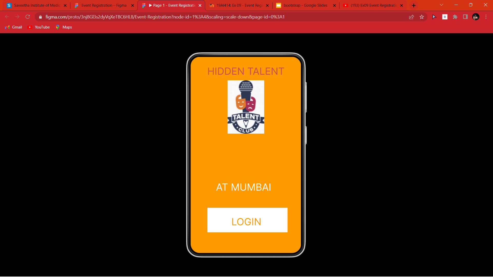
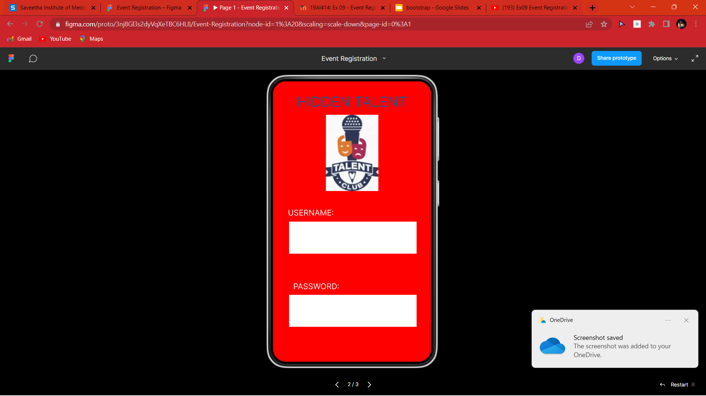
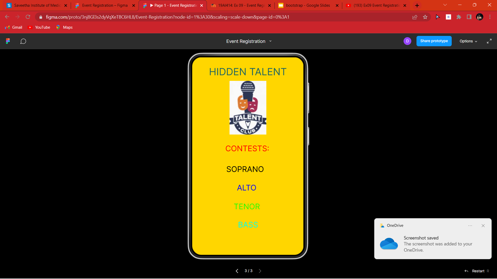

# Event Registration Web Application

## AIM:
To design, develop and deploy a web application for event registration.

## DESIGN STEPS:

### Step 1:
Create a new frame.

### Step 2:
Select any one preset size of your choice.

### Step 3:
Select the shapes you need.

### Step 4:
Import images as needed.

### Step 5:
Create pages based on your need and link them.

### Step 6:

Validate the HTML and CSS code.

### Step 6:

Publish the website in the given URL.

## DESIGN TOOL:
Figma

## PROGRAM
```
/* home page */
position: relative;
width: 360px;
height: 640px;
background: #FF9900;
/* PASSIONATE SINGERS CLUB */
position: absolute;
width: 351px;
height: 81px;
font-family: 'Inter';
font-style: normal;
font-weight: 400;
font-size: 32px;
line-height: 39px;
text-align: center;
color: #FFFFFF;
/* LOGIN PAGE */
position: relative;
width: 360px;
height: 640px;
background: #FF0000;
/* CONTESTS */
position: relative;
width: 360px;
height: 640px;
background: #FFD600;
```
## OUTPUT:




## RESULT:
The program to design, develop and deploy a web application for event registration is completed successfully.